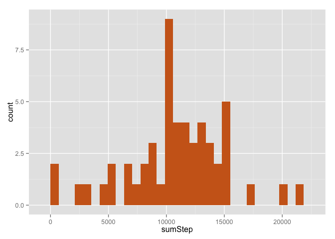
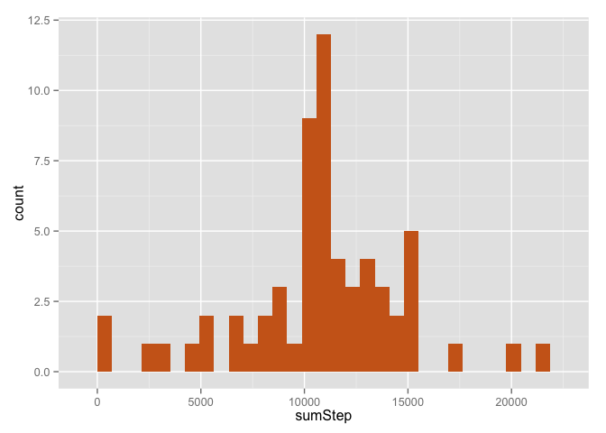

# Reproducible Research: Peer Assessment 1


## Loading and preprocessing the data


```r
library(lubridate)
library(dplyr)
library(ggplot2)
library(lattice)
Sys.setlocale("LC_TIME", "en_US")
```

```
## [1] "en_US"
```

```r
actWithNA<-read.csv('activity.csv')
actWithNA<-transform(actWithNA,date=ymd(date),steps=as.numeric(steps))
act<-na.omit(actWithNA)
```

## What is mean total number of steps taken per day?

```r
actSum<-act %>%
        group_by(date) %>%
        summarise(sumStep=sum(steps))
g<-ggplot(actSum,aes(x=sumStep))+
        geom_histogram(fill=colors()[55])
suppressMessages(print(g))
```

 

```r
meanValue<-mean(actSum$sumStep)
medianValue<-median(actSum$sumStep)
meanValue
```

```
## [1] 10766.19
```

```r
medianValue
```

```
## [1] 10765
```
The mean and median of the total number of steps taken per day is 10766.19 and 10765 respectively. 

## What is the average daily activity pattern?


```r
actDay<-act %>%
        group_by(interval) %>%
        summarise(averageStep=mean(steps))
plot(actDay,type='l')
```

 

```r
whichInterval<-actDay$interval[which.max(actDay$averageStep)]
```
5-minute interval "835"  contains the maximum number of steps on average across all the days in the dataset. 

## Imputing missing values


```r
naRow<-nrow(actWithNA)-sum(complete.cases(actWithNA))
```
2304 rows with NA in the dataset
Imputing missing value by the mean value of the same interval as follow:

```r
imputedact<-merge(actWithNA,actDay,by='interval')
naId<-is.na(imputedact$steps)
imputedact$steps[naId]<-imputedact$averageStep[naId]
imputedactSum<-imputedact %>%
        group_by(date) %>%
        summarise(sumStep=sum(steps))
imputedg<-ggplot(imputedactSum,aes(x=sumStep))+
        geom_histogram(fill=colors()[55])
suppressMessages(print(imputedg))
```

 

```r
imputedmeanValue<-mean(imputedactSum$sumStep)
imputedmedianValue<-median(imputedactSum$sumStep)
imputedmeanValue
```

```
## [1] 10766.19
```

```r
imputedmedianValue
```

```
## [1] 10766.19
```
 
After imputing missing value by the mean value of the same interval. The mean and median of the total number of steps taken per day is 10766.19 and 10766.19 respectively. They seem very close to the estimates calculating from the dataset without imputation. These two figures shows the imputing missing data doesn't change the distribution.

## Are there differences in activity patterns between weekdays and weekends?

```r
weekDay<-weekdays(imputedact$date,abbreviate=T)
imputedact$isWeekend<-ifelse(weekDay=='Sat'|weekDay=='Sun','weekend','weekday')
imputedact$isWeekend<-as.factor(imputedact$isWeekend)
imputedactDay<-imputedact %>%
        group_by(interval,isWeekend) %>%
        summarise(averageStep=mean(steps))
xyplot(averageStep~interval|isWeekend,data=imputedactDay,type='l',
       layout = c(1, 2),
       ylab = "Number of steps")
```

 

